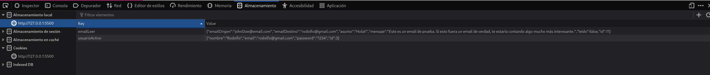
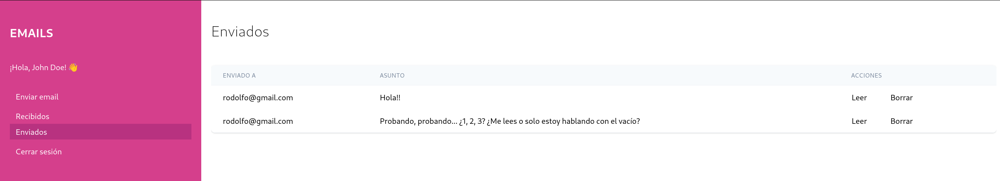
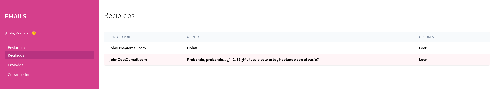
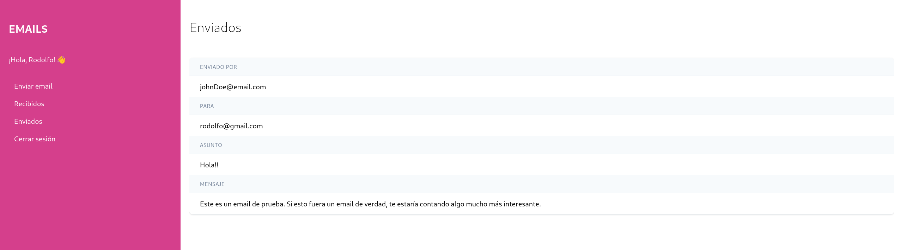

# Proyecto 3: Mejora y ampliación de un proyecto web
Desarrollo web en entorno cliente

## Proyecto base
[Envío de emails](https://655c75aa4ac8fd5dc915fd7d--merry-blancmange-46af10.netlify.app/)

## Mejoras y funcionalidades añadidas
### Iniciar sesión y registrar usuarios para acceder al servicio de mensajería
- Al iniciar se cargan dos usuarios de un JSON, para poder hacer pruebas

```json
{
  "usuarios": [
    {
      "nombre": "John Doe",
      "email": "johnDoe@email.com",
      "password": "pestillo"
    },
    {
      "nombre": "Bash Scripterson",
      "email": "bash.scripterson@terminalshell.com",
      "password": "sudoNotTelling"
    }
  ]
}
```

- Los usuarios registrados (los dos anteriores y los nuevos) se almacen en una base de datos IndexedDB
- Al iniciar sesión se valida que el usuario ya exista en la base de datos
- Para controlar los datos del usuario que ha iniciado sesión sus datos se almacenan en LocalStorage
- Una vez que el usuario inicia sesión o se crea una cuenta nueva aparece en la bandeja de emails recibidos
- Al cerrar la sesión el usuario vuelve a aparecer en el formulario de inicio de sesión

Usuario activo guardado en LocalStorage:


### Los emails se almacenan en una base de datos usando IndexedDB
- Información que se guarda: email del usuario que lo envía, email del usuario a quién va dirigido, asunto y mensaje.
- El usuario dispone de dos apartados para consultar los emails:
    - La bandeja principal que muestra los emails que ha recibido (los emails que todavía no ha leido se destacan en rosa).
    - Una segunda bandeja donde puede consultar los emails enviados.

Ejemplo de emails enviados por el usuario John Doe:


Ha Rodolfo todavía le queda un email por leer:


### Acciones sobre los emails
- Los emails se pueden eliminar, pero solo puede hacerlo el usuario que lo envió.
- Todos los emails permiten la acción de "Leer" para ver su contenido. Al pulsar en esta opción el listado desaparece y se muestran solo los datos del email: quien lo envió, a quién, el asunto y el mensaje.
    - Para saber que de que email mostrar el contenido en el cambio de pantallas, los datos se almacenan en LocalStorage.

Leer un email:


Email que el usuario quiere leer guardado en LocalStorage:


## Instrucciones
> [!WARNING] 
> Aunque se cargan dos usuarios al iniciar, la base de datos de emails está vacía, es necesario crearlos.